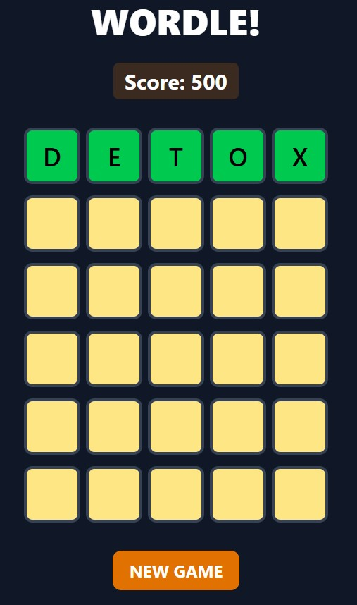

# Wordle Clone

A modern implementation of the popular word-guessing game Wordle, built with React and styled with Tailwind CSS. Features a responsive design, score tracking system, and animated feedback.



## Features

- 🎮 Classic Wordle gameplay mechanics
- 💾 Local score tracking that persists for 1 hour
- 📱 Fully responsive design for all devices
- ✨ Smooth animations and visual feedback
- 🎯 Word validation and color-coded feedback
- ⌨️ Full keyboard support

## Tech Stack

- **React** - UI framework
- **Vite** - Build tool and development server
- **Tailwind CSS** - Utility-first CSS framework
- **PropTypes** - Runtime type checking for React props

## Getting Started

### Prerequisites

- Node.js (version 14 or higher)
- npm or yarn package manager

### Installation

1. Clone the repository
```bash
git clone https://github.com/yourusername/wordle-clon.git
cd wordle-clon
```

2. Install dependencies
```bash
npm install
# or
yarn install
```

3. Start the development server
```bash
npm run dev
# or
yarn dev
```

4. Open your browser and visit `http://localhost:5173`

## How to Play

1. Try to guess the five-letter word
2. After each guess, the letters will be color-coded:
   - 🟩 Green: Letter is correct and in the right position
   - 🟨 Yellow: Letter is in the word but in the wrong position
   - ⬜ Gray: Letter is not in the word

## Development

To build for production:
```bash
npm run build
# or
yarn build
```

To preview the production build:
```bash
npm run preview
# or
yarn preview
```

## Contributing

Feel free to submit issues and enhancement requests!

## License

This project is open source and available under the [MIT License](LICENSE).